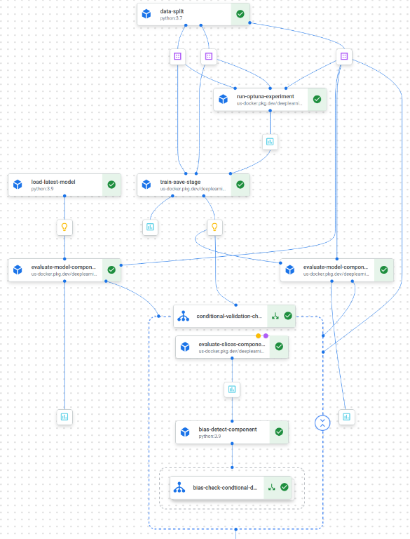

# Amazon-Reviews-Sentiment-Analysis

### Team Members:
Valli Meenaa Vellaiyan <br>
Niresh Subramanian <br>
Venkata Subbarao Shirish Addaganti <br>
Harshit Sampgaon <br>
Prabhat Chanda <br>
Praneeth Korukonda <br>

---

## Introduction

In today's competitive e-commerce landscape, understanding customer feedback is critical for improving product offerings and enhancing the overall customer experience. This project focuses on leveraging sentiment analysis of Amazon reviews to gain deeper insights into customer sentiment. By categorizing reviews into positive, neutral, or negative, businesses like Amazon can extract actionable insights to inform product decisions, optimize customer service, and drive strategic initiatives aimed at improving customer satisfaction.

The goal of this project is to automate the end-to-end process of analyzing review data, from ingestion and pre-processing to model training, deployment, and monitoring. This automated solution not only increases operational efficiency but also helps Amazon to better understand how customers feel about their products and services. By analyzing sentiment trends over time, the model provides valuable insights into key pain points, emerging trends, and areas for improvement across different product categories.

Using advanced sentiment analysis, this project enables Amazon to identify critical feedback faster, enhance the customer experience, and make data-driven decisions that align with business goals such as increasing customer retention, boosting sales, and reducing return rates. This ultimately contributes to a more responsive and customer-focused business strategy, directly impacting business growth.

## Dataset Overview

### UCSD Amazon Reviews 2023
The UCSD Amazon Reviews 2023 dataset is a large, publicly available collection of customer reviews across multiple product categories on Amazon. It contains approximately **338 million reviews**, spanning diverse customer experiences and sentiments.

The dataset provides a foundation for sentiment analysis and is integral to our project's goal of classifying reviews into positive, neutral, or negative categories. The large volume and diversity of the dataset make it ideal for building scalable machine learning models.

### Citation
- **Dataset Source**: [UCSD Amazon Reviews 2023](https://amazon-reviews-2023.github.io/main.html)
- **Citation**: Jérémie Rappaz, Julian McAuley, Karl Aberer. *Recommendation on Live-Streaming Platforms: Dynamic Availability and Repeat Consumption*, RecSys, 2021.

### Data Card
- **Format**: CSV/JSON
- **Size**: 338 million reviews
- **Data Types**: String, Numeric, List, Boolean, Dictionary, Timestamps
- **Key Features**:
  - **Review Text**: The main content of customer feedback
  - **Star Rating**: Ratings from 1 to 5 stars
  - **Product Category**: Product category for the reviewed item
  - **Review Timestamp**: Date and time of the review
  - **Product Metadata**: Additional product-related details
  - **Verified Purchase**: Indicator if the review is from a verified purchase
  - **Review Helpfulness**: Upvotes or downvotes received by the review (if available)

### Data Rights and Privacy
- The dataset is available for non-commercial use, and user identifiers like reviewer IDs are excluded to prevent privacy breaches. The project adheres to data minimization principles and complies with relevant privacy regulations.

## Folder Structure

```bash
.
├── .dvc                        # DVC configuration files for data versioning
├── .github/workflows           # GitHub Actions workflows for CI/CD
├── data_pipeline               # Main data pipeline directory
├── milestones                  # Project milestone documents
├── model_pipeline              # Machine learning pipelines
│   ├── rag                     # Retrieval-Augmented Generation pipeline
│   │   ├── config              # RAG configuration files
│   │   ├── dags                # DAGs for RAG
│   │   │   └── utils
│   │   └── data                # Data for RAG pipeline
│   └── Streamlit               # Streamlit-based interactive dashboards
│       └── items               # Dashboard components
└── project_pipeline/           # Final project pipeline to run data and model pipelines
    ├── config                           
    ├── dags                             # Directed Acyclic Graph (DAG) files for Airflow workflows.
    │   ├── batch_processing_dag.py      # DAG for batch processing tasks.
    │   ├── data_acquisition_dag.py      # DAG for acquiring data.
    │   ├── data_preprocessing_dag.py    # DAG for data preprocessing tasks.
    │   ├── data_utils                   # Directory containing utility scripts for data tasks.
    │   │   ├── config.py                # Configuration file for data utilities.
    │   │   ├── data_collection          # Data collection related scripts 
    │   │   ├── data_preprocessing       # Data preprocessing related scripts 
    │   │   ├── data_validation          # Data validation related scripts 
    │   │   ├── __init__.py              # Initialization file for the data_utils package.
    │   ├── data_validation_dag.py       # DAG for data validation tasks.
    │   ├── gcs_pull_dag.py              # DAG for pulling data from Google Cloud Storage (GCS).
    │   ├── __init__.py                  # Initialization file for the DAG package.
    │   ├── model_utils                  # Directory for model utility scripts.
    │   │   ├── dsl_components.py        # Kubeflow components for the pipeline.
    │   │   ├── dsl_pipeline.py          # Pipeline definition using a components.
    │   │   ├── model_config.py          # Configuration file for models.
    │   │   ├── pipeline_CI_CD.py        # CI/CD pipeline for model deployment and monitoring.
    │   │   └── src                      # Source code for model utility components 
    │   ├── sampling_serve_dag.py        # DAG for serving sampled data.
    │   ├── sampling_train_dag.py        # DAG for training models with sampled data.
    │   ├── serve_utils                  # Directory for serving-related utilities.
    │   │   ├── batch_processing.py      # Script for batch processing during model serving.
    │   └── vertex_ai_submit_dag.py      # DAG for submitting jobs to Vertex AI.
    ├── data                             # Directory for storing datasets.
    │   ├── labeled                      # Labeled data for training and serving.
    │   │   ├── serve                    # Data for model serving predictions.
    │   │   └── train                    # Data for model training.
    │   ├── raw                          # Raw data before any processing or cleaning.
    │   └── sampled                       # Sampled data used for training or serving.
    │       ├── serving                  # Sampled data for serving predictions.
    │       └── training                 # Sampled data for training models.
    ├── docker-compose.yaml              # Docker Compose file for orchestrating multi-container applications.
    ├── Dockerfile                       # Dockerfile to build the image for the pipeline.
    ├── __init__.py                      # Initialization script for the project pipeline package.
    ├── logs                             # Logs generated during the pipeline execution.
    │   ├── dag_id=06_vertex_ai_pipeline_job_submission_with_run
    │   ├── dag_id=vertex_ai_pipeline_job_submission_with_run
    │   ├── dag_processor_manager
    │   └── scheduler                    # Scheduler logs for specific dates.
    │       ├── 2024-12-03
    │       └── 2024-12-05
    ├── plugins                          # Custom plugins used in the pipeline.
    └── tests                            # Unit and integration tests for various pipeline components.
        ├── data_collection             # Tests for data collection processes.
        │   ├── __init__.py             # Initialization file for data collection tests.
        │   ├── test_data_acquisition.py# Tests for data acquisition functionality.
        │   └── test_data_sampling.py   # Tests for data sampling processes.
        ├── data_preprocessing          # Tests for data preprocessing tasks.
        │   ├── __init__.py             # Initialization file for data preprocessing tests.
        │   ├── test_aspect_data_labeling.py # Tests for aspect-based data labeling.
        │   ├── test_aspect_extraction.py    # Tests for aspect extraction.
        │   ├── test_data_cleaning_pandas.py # Tests for data cleaning using pandas.
        │   └── test_data_labeling.py        # Tests for data labeling functionality.
        ├── data_validation             # Tests for data validation procedures.
        │   └── test_schema_validation.py    # Tests for schema validation of data.
        └── __init__.py                 # Initialization file for the tests package.

```

---

## Repository Setup

### Prerequisites
Ensure you have the following installed:
- Python 3.8+
- `pip` or `conda` for managing Python packages
- Docker (for containerized pipeline execution)
- DVC (Data Version Control)
- Apache Airflow
- Google Cloud SDK (for cloud storage and pipeline integration)

### Steps to Set Up

1. **Clone the repository:**
    ```bash
    git clone https://github.com/MLOps-Group-3/Amazon-Reviews-Sentiment-Analysis.git
    cd Amazon-Reviews-Sentiment-Analysis
    ```

2. **Install dependencies:**
    ```bash
    pip install -r project_pipeline/requirements.txt
    ```

3. **Set up Airflow:**
    - Navigate to the `project_pipeline` directory and initialize Airflow:
        1. Navigate to the `project_pipeline` directory.

        ```
        cd project_pipeline
        ```
        2. Run the following command to set up Airflow with Docker Compose:

        ```bash
        docker-compose up airflow-init
        ```

        #### Start Airflow service:
        Once Airflow is initialized, you can start the Airflow service by running:

        ```bash
        docker-compose up
        ```

        This will bring up the Airflow web server and scheduler, ready to execute your DAGs.

        #### Save GCP Service Account Keys:
        - Save your GCP service account key in the `project_pipeline/config` directory as `gcp-sa-key.json`.
        - Ensure that the keys and other environment variables are correctly set in the `.env` file.

        #### Create and configure the `.env` file:
        In the `project_pipeline` directory, create a `.env` file and add the following environment variables:

        ```
        OPENAI_API_KEY=
        OPENAI_MODEL=
        PINECONE_API_KEY=
        PINECONE_ENVIRONMENT=us-east-1-aws
        AIRFLOW_UID=50000
        SMTP_USER=
        SMTP_PASSWORD=
        SMTP_MAIL_FROM=
        SMTP_HOST=
        SMTP_PORT=
        GCS_SERVICE_ACCOUNT_KEY=/opt/airflow/config/gcp-sa-key.json
        GCS_BUCKET_NAME=
        GCS_BUCKET_NAME_MODEL=
        ```

        Ensure to replace the placeholders with your actual credentials and configuration values:
        - `OPENAI_API_KEY` and `OPENAI_MODEL`: For connecting to the OpenAI API.
        - `PINECONE_API_KEY` and `PINECONE_ENVIRONMENT`: For connecting to Pinecone for vector database access.
        - `GCS_SERVICE_ACCOUNT_KEY`: Path to your GCP service account JSON file.
        - `GCS_BUCKET_NAME`: Name of the Google Cloud Storage bucket.


4. **Run the pipeline:**
    - Trigger DAGs via the Airflow UI to execute stages of the pipeline (e.g., data acquisition, validation, preprocessing).

5. **Set up DVC:**
    - Pull the latest data files:
        ```bash
        dvc pull
        ```

6. **Configure GCP:**
    - Authenticate using the Google Cloud SDK:
        ```bash
        gcloud auth login
        ```
    - Set up your bucket for data storage and integration:
        ```bash
        gcloud storage buckets create gs://your-bucket-name
        ```

7. **Test the pipeline:**
    - Run the tests for data collection, validation, and preprocessing:
        ```bash
        pytest data_pipeline/tests
        ```

### Additional Information
- For detailed setup instructions for the `data_pipeline`, refer to [data_pipeline/README.md](data_pipeline/README.md).
- For setting up model pipelines and deployments, refer to the `model_pipeline` directory and its subfolders for specific configurations.

---

## Key Features

1. **End-to-End Pipeline Automation:**
    - Modular DAGs in Apache Airflow for ingestion, validation, preprocessing, and sentiment analysis.

2. **DVC Integration:**
    - Ensures version control for data and tracks changes across pipeline stages.

3. **Cloud Integration:**
    - Utilizes Google Cloud Platform (GCP) for scalable data storage and model deployment.

4. **Sentiment Analysis Models:**
    - Incorporates pre-trained models like BERT and RoBERTa for high-accuracy sentiment classification.

5. **RAG for Summarization:**
    - Implements Retrieval-Augmented Generation for aspect-wise summarization of reviews.

6. **Interactive Dashboards:**
    - Streamlit-based dashboards for visualization of insights and sentiment trends.

7. **CI/CD with GitHub Actions:**
    - Automated testing and deployment workflows for robust pipeline operations.

---

## Data Pipelines in Airflow

This repository contains Airflow DAGs for preprocessing, validating, and analyzing Amazon review data through a series of modular tasks. Each DAG corresponds to a distinct stage in the data pipeline, leveraging Python and Pandas for data transformation, sampling, validation, and sentiment analysis.

### Pipeline Stages Overview

1. **Data Acquisition:**
   - Extracts and ingests Amazon review data from the UCSD dataset.
   - Stores raw data for further processing.

2. **Data Sampling:**
   - Samples review data across specified categories to create balanced datasets.
   - Consolidates sampled data for downstream analysis.

3. **Data Validation:**
   - Ensures dataset quality and consistency by checking schema, null values, and integrity.
   - Logs invalid rows for further debugging and cleaning.

4. **Data Preprocessing:**
   - Cleans data by removing duplicates, handling missing values, and normalizing text.
   - Labels reviews with sentiment tags (positive, neutral, negative).

5. **Sentiment Analysis and Summarization:**
   - Applies pre-trained models like BERT for sentiment classification.
   - Implements RAG (Retrieval-Augmented Generation) for generating aspect-wise summaries.

### Key Tools and Frameworks
- **Apache Airflow:**
  - Orchestrates the pipeline with modular, reusable DAGs.
- **DVC:**
  - Tracks data changes and versions across pipeline stages.
- **MLflow:**
  - Manages model experiments and tracks metrics for sentiment analysis.

### DVC Integration
- The repository uses DVC for version control of datasets and intermediate outputs. Ensure you have the latest configuration pulled:
    ```bash
    dvc pull
    ```

---

## Model Pipeline

The `model_pipeline` directory contains workflows for training, evaluating, and deploying machine learning models for sentiment analysis and summarization.



### Key Features
1. **Sentiment Analysis Pipeline:**
   - Trains state-of-the-art models like BERT and RoBERTa.
   - Performs hyperparameter tuning and bias detection to optimize performance.

2. **RAG Pipeline:**
   - Uses a retrieval-based approach for generating aspect-wise summaries.
   - Handles large document contexts for better summarization accuracy.

3. **Deployment with PyTorch Serve:**
   - Deploys trained models as scalable REST APIs.
   - Includes endpoint configurations and predictor utilities.

4. **Interactive Dashboards:**
   - Built with Streamlit for exploring sentiment trends and insights dynamically.

### Tools and Integrations
- **MLflow**: Tracks model metrics, artifacts, and experiments.
- **Vertex AI**: Deploys trained models and monitors their performance in the cloud.
- **Apache Airflow**: Manages the orchestration of modular pipelines.
