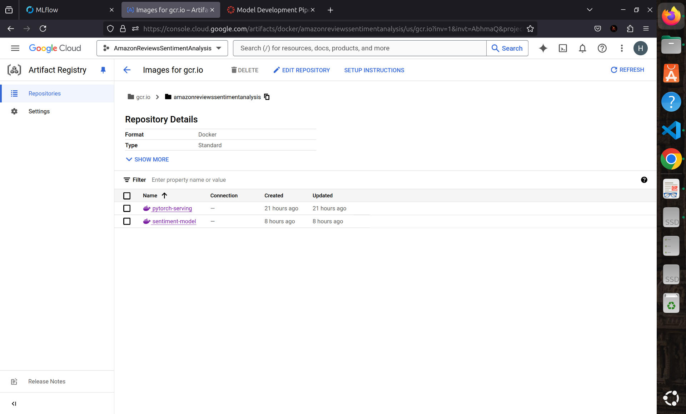

# Sentiment Model Pipeline

This repository contains the model pipeline for training, evaluating, and monitoring a sentiment analysis model. The pipeline includes data preparation, hyperparameter tuning, model training, evaluation, and bias detection. It also integrates with MLflow for experiment tracking and supports retriggering for underperforming models.


## Project Structure

```plaintext
├── dags
│   ├── mlflow_tracking_dag.py      # Airflow DAG for MLflow experiment tracking
│   └── __pycache__
├── docker-compose.yaml             # Docker configuration for running the pipeline
├── pipeline.py                     # Master pipeline script
├── requirements.txt                # Python dependencies
└── src
    ├── app.py                      # Flask app for model interaction
    ├── app_requirements.txt        # Additional requirements for the app
    ├── bert_output/                # Directory for BERT model logs
    ├── bias_detect.py              # Detect and mitigate model bias
    ├── config.py                   # Pipeline configuration settings
    ├── data/                       # Data directory
    ├── evaluate_model.py           # Evaluate the trained model
    ├── evaluate_model_slices.py    # Evaluate model performance on data slices
    ├── experiment_runner_optuna.py # Hyperparameter tuning with Optuna
    ├── experiment_runner.py        # General experiment runner
    ├── mlruns/                     # MLflow directory for experiment tracking
    ├── prepare_data.py             # Data preparation script
    ├── roberta_output/             # Directory for RoBERTa model logs
    ├── train_save.py               # Train and save the model
    └── utils/                      # Utility scripts
        ├── bert_model.py           # BERT model implementation
        ├── data_loader.py          # Data loading functions
        ├── roberta_model.py        # RoBERTa model implementation
```

## Features

- **Data Preparation**: Prepares raw data for training and evaluation, ensuring compatibility with the sentiment model.
- **Hyperparameter Tuning**: Uses Optuna for automated hyperparameter optimization.
- **Model Training and Evaluation**: Trains the sentiment model using BERT or RoBERTa and evaluates the model, logging metrics including the F1 score.
- **Bias Detection**: Identifies and mitigates biases in model predictions to ensure fairness.
- **F1 Score Monitoring**: Automatically extracts the F1 score and retriggers experiments if it falls below a threshold (default: 0.6).
- **Experiment Tracking**: Integrates with MLflow to track model training, metrics, and artifacts.
- **Flexible Pipeline Execution**: Supports restarting from any pipeline step after failure.
- **Containerized Workflow**: Dockerized setup for seamless development and deployment.

## Getting Started

### Prerequisites

1. Install dependencies:
   ```bash
   pip install -r requirements.txt
   ```
2. Ensure the following are configured:
   - MLflow for tracking experiments (`mlruns` directory).
   - Docker for running the pipeline in a containerized environment.

### Running the Pipeline

1. Run the entire pipeline:
   ```bash
   python pipeline.py
   ```
2. Restart the pipeline from a specific step: Modify `pipeline.py` to set the starting step and execute:
   ```bash
   python pipeline.py
   ```

### Configuration

Update `config.py` to adjust the pipeline's behavior, including:
- Model parameters
- Data paths

## Experiment Tracking with MLflow

- The `mlruns` directory contains logs and metrics for all experiments.
- Use the Airflow DAG in `dags/mlflow_tracking_dag.py` to automate MLflow tracking.

## Retriggering

The pipeline automatically retriggers under the following conditions:
1. **Low F1 Score**: Retriggers from hyperparameter tuning if the score is below 0.6.
2. **Bias Detection**: Retriggers from the bias mitigation step if biases are detected.

Flags are used to prevent infinite retrigger loops.

## Docker Setup

1. Build and start the pipeline with Docker Compose:
   ```bash
   docker-compose up --build
   ```
2. Modify the `docker-compose.yaml` file to adjust services as needed.

---

**Note**: Docker with MLflow integration was successful. However, Airflow with GPU compute setup was impossible to setup locally, and the pipeline is transitioned to the cloud for scalability and better resource management.

---

## Automated Machine Learning Pipeline

This pipeline orchestrates the end-to-end machine learning workflow, automating data preparation, hyperparameter optimization, model training, evaluation, and bias detection. It includes mechanisms for retriggering specific steps if predefined thresholds (e.g., low F1 scores or detected biases) are not met.

### Pipeline Steps

1. **Prepare Data (`prepare_data.py`)**:
   - Cleans and normalizes the raw dataset.
   - Splits the data into training, validation, and test sets.
   - Balances underrepresented categories in the data.

2. **Experiment Runner (`experiment_runner_optuna.py`)**:
   - Performs hyperparameter tuning using Optuna.
   - Logs parameters and results to MLflow.
   - Saves the best hyperparameters for further steps.

3. **Train and Save Model (`train_save.py`)**:
   - Trains the sentiment analysis model using the optimized hyperparameters.
   - Saves the trained model locally and optionally uploads it to Google Cloud Storage (GCS).

4. **Evaluate Model (`evaluate_model.py`)**:
   - Evaluates the trained model on the test dataset.
   - Computes accuracy, precision, recall, and F1 score.
   - Logs a detailed classification report.

5. **Evaluate Model Slices (`evaluate_model_slices.py`)**:
   - Analyzes model performance across data slices (e.g., based on `year`, `main_category`).
   - Generates slice-specific metrics to identify areas of underperformance.

6. **Bias Detection (`bias_detection.py`)**:
   - Flags potential biases by comparing slice-level metrics against thresholds derived from the full dataset.
   - Logs slices with significant underperformance for further investigation.

---

### Key Features

- **Threshold-Based Retriggering**:
  - Retriggers specific steps in the pipeline if:
    - F1 score falls below 0.6.
    - Bias is detected in slice evaluations.
  - Uses flag files (`.pipeline_f1_retriggered`, `.pipeline_bias_retriggered`) to prevent infinite loops.

- **Pipeline Orchestration**:
  - Automates the sequential execution of scripts with logging and error handling.
  - Ensures a smooth workflow from data preparation to model deployment.

- **F1 Score Monitoring**:
  - Extracts F1 score from logs.
  - Automatically restarts the pipeline at the hyperparameter tuning step if the score is below the threshold.

- **Bias Handling**:
  - Evaluates metrics for slices of the dataset and logs potential biases.
  - Detects underperforming slices based on minimum sample size (10% of full dataset) and F1 score (below 90% of full dataset F1).

---

### Functions

- `run_script(script_name)`:
  - Executes a script, captures its output, and logs success or failure.

- `extract_f1_score(log_output)`:
  - Parses the log output to extract the F1 score for threshold comparison.

- `restart_pipeline_from_experiment_runner()`:
  - Retriggers the pipeline starting from the experiment runner step if the F1 score is below the threshold.

- `process_pipeline(pipeline_script, from_step)`:
  - Continues the pipeline execution from a specific step.

---
## Additional Reference

For detailed function setup, configurations, and usage of each script, refer to [src/README.md](src/README.md).


## MLflow Logging in the Workflow

MLflow is integrated into this workflow to enable comprehensive tracking and management of model experiments. Below is an overview of how MLflow is utilized:


### Key Features of MLflow Integration

1. **Experiment Setup**:
   - A unique experiment is created using `mlflow.set_experiment()` with a timestamped name, ensuring clear organization of runs for this specific task.

2. **Parameter Logging**:
   - During each training run, key hyperparameters such as `model_name`, `learning_rate`, `batch_size`, `num_epochs`, `weight_decay`, and `dropout_rate` are logged using `mlflow.log_params()`. This makes it easy to trace how different configurations affect model performance.

3. **Metric Logging**:
   - After evaluating the model on the test dataset, metrics like `test_f1` are logged using `mlflow.log_metric()`. These metrics provide a quantitative measure of the model's performance.

4. **Run Management**:
   - Each training and evaluation run is tracked as a separate entity within the experiment. The runs are uniquely identified by descriptive names, such as `BERT_lr_1e-5_wd_1e-4_do_0.1`.

5. **Best Model Tracking**:
   - The best-performing model and its associated hyperparameters are logged as the "best run." This allows easy identification and reuse of the optimal configuration.

6. **Integration with Optuna**:
   - As Optuna performs hyperparameter optimization, each trial's results are logged to MLflow, providing a unified view of all experiments and their outcomes.

7. **Artifact Logging (Optional)**:
   - Model artifacts, like trained weights or configuration files, can also be logged to MLflow, enabling seamless retrieval and deployment of models.

---

### Benefits of MLflow Integration

- **Experiment Traceability**:
  - MLflow ensures all experiments are logged systematically, allowing users to revisit and analyze past runs.

- **Reproducibility**:
  - With logged parameters and metrics, any experiment can be reproduced exactly.

- **Performance Comparison**:
  - MLflow provides a platform to compare multiple runs side-by-side to determine the most effective configurations.

- **Ease of Deployment**:
  - The best-performing models can be registered and deployed directly from MLflow's model registry.

---

In this workflow, MLflow acts as a critical tool for managing and optimizing the development of the sentiment analysis models, ensuring scalability and efficiency.


# Saving to Vertex AI Model Registry

This section outlines the steps for containerizing a trained model and saving it to the Vertex AI Model Registry for deployment and inference.

## Overview

The process involves:
1. Packaging the trained model and serving script into a Docker container.
2. Uploading the container to Google Container Registry (GCR).
3. Registering the model in Vertex AI for seamless deployment and management.

---

## Steps for Saving the Model

### 1. **Containerization**

The Dockerfile creates a containerized environment for the trained model and its serving script.

#### Dockerfile Details
- **Base Image**:
  - The container uses the `python:3.8-slim` image as the base.
- **Working Directory**:
  - All operations are performed in the `/app` directory within the container.
- **Dependencies**:
  - Application dependencies are listed in `app_requirements.txt` and installed using `pip`.
- **Application Files**:
  - `app.py`: Contains the Flask application for serving the model.
  - `utils/`: Directory with supporting utility files.
- **Environment Variables**:
  - `MODEL_NAME`: Name of the model (e.g., `BERT`).
  - `MODEL_FILE`: Path to the trained model file (e.g., `BERT_final_model.pth`).
  - `GCS_BUCKET_NAME`: GCS bucket name where the model is stored.
  - `GCS_MODEL_PATH`: Path to the model file in the GCS bucket.
- **Gunicorn Configuration**:
  - The Flask app is served using Gunicorn for production-level performance.
- **Port Exposure**:
  - The container exposes port `8080` for incoming requests.

#### Dockerfile Example
Refer to the Dockerfile provided in the project repository for the complete setup.

---

### 2. **Building and Pushing the Docker Image**

#### Build the Docker Image
```bash
docker build -t gcr.io/amazonreviewssentimentanalysis/pytorch-serving:latest .
```
#### Push Docker Image to GCR to deploy later

```bash
docker push gcr.io/amazonreviewssentimentanalysis/pytorch-serving:latest
```

